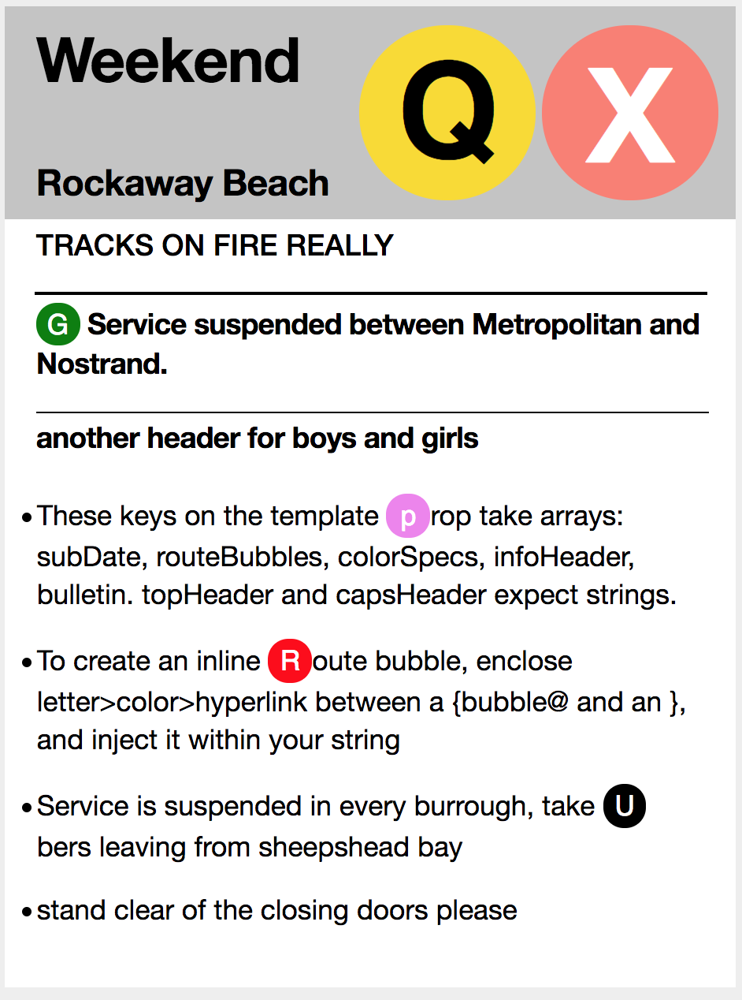

# MTA Planned Work Theme Card Template

A React component in the form of a designed card! The text can be filled out by passing a 'template' object to props. The prop 'flyerWidth' takes a Number that will set the scale of the component in your flow. The inline 'Route Bubble' designs can be added directly into text by injecting a string pattern that is identified by regex.



#### Props
``` 
template - object
flyerWidth - number(of px)
```

#### The following keys of the template object will set the text:

```
  topHeader: 'A string'
  subDate: ['An Array of up to two strings'] 
  routeBubbles: ['An Array of up to two strings']
  colorSpecs: ['An Optional Array of up to two named color strings or hex values']
  capsHeader: 'A string'
  infoHeader: ['An Array of many strings']
  bulletin: ['An Array of many strings']

```

Example:
```
const template1 = {

  topHeader: 'Weekend',
  subDate: ['Rockaway Beach'],
  routeBubbles: ['Q', 'X'],
  colorSpecs: [null, 'salmon'],
  capsHeader: `TRACKS ON FIRE REALLY`,
  infoHeader: ['{bubble@G>green>www.google.com} Service suspended between Metropolitan and Nostrand.', 'another header for boys and girls'],
  bulletin: ['These keys on the template {bubble@p>violet}rop take arrays:  subDate, routeBubbles, colorSpecs, infoHeader, bulletin. topHeader and capsHeader expect strings.',
   'To create an inline {bubble@R>red}oute bubble, enclose letter>color>hyperlink between a {bubble@ and an }, and inject it within your string',
  'Service is suspended in every burrough, take {bubble@U>black>http://uber.com}bers leaving from sheepshead bay', 
  'stand clear of the closing doors please'],
}
```

#### To create route bubble letter:
Route bubbles are identified by ```${bubble@ }``` enclosing brackets. Within them should go specifications for 1.a character 2. a string for color (named or hex) 3. an optional href for a link. They are split by ```>``` characters.
The result in action looks like this:

```${bubble@G>#4286f4>http://google.com}```

This will produce a blue colored route bubble that says G and links to google.com when clicked.


To Demo:

```
npm i
npm run docs
```